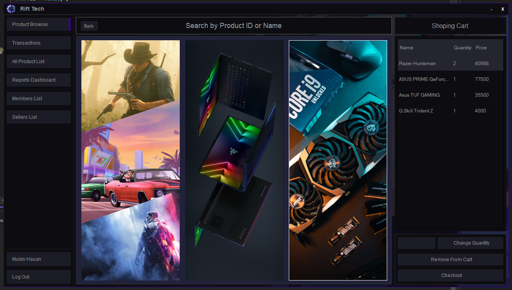

# Rift Tech Point of Sale (POS) & Inventory Management System




## About

Rift Tech POS is a comprehensive Point of Sale and Inventory Management System designed specifically for technology retail businesses. This desktop application provides an efficient solution for managing sales transactions, inventory tracking, customer relationships, and business reporting.

### Key Features

- **Sales Management**: Process sales transactions quickly and efficiently with an intuitive checkout interface
- **Inventory Management**: Track products across multiple categories including laptops, PC parts, and games
- **Product Management**: Add, edit, and manage product details with image support
- **User Management**: Multi-user support with role-based access (Sellers, Members)
- **Customer Management**: Maintain customer records and purchase history
- **Reports Dashboard**: Generate comprehensive sales and inventory reports
- **User Profiles**: Customizable user profiles with authentication and password recovery
- **Product Categories**: Organized product browsing by categories

### Technology Stack

- **Framework**: .NET Framework (Windows Forms Application)
- **Language**: C#
- **Database**: Microsoft SQL Server
- **IDE**: Visual Studio

## How to Run This Software

### Prerequisites

1. **Visual Studio** - Download and install Visual Studio (Community Edition or higher)
   - [Download Visual Studio](https://visualstudio.microsoft.com/downloads/)

2. **Microsoft SQL Server** - Download and install SQL Server
   - [Download SQL Server](https://www.microsoft.com/en-us/sql-server/sql-server-downloads)

3. **SQL Server Management Studio (SSMS)** - For database management
   - [Download SSMS](https://docs.microsoft.com/en-us/sql/ssms/download-sql-server-management-studio-ssms)

### Installation Steps

#### Step 1: Clone or Download the Project
```bash
git clone <repository-url>
```
Or download and extract the project files.

#### Step 2: Set Up the Database

1. Open **SQL Server Management Studio (SSMS)**
2. Connect to your SQL Server instance
3. Create a new database named `ProjectR_DB`:
   ```sql
   CREATE DATABASE ProjectR_DB;
   ```
4. Open and execute the database script:
   - Navigate to `Rift_Tech_POS\DatabaseQuery\Rift Tech Database Script.sql`
   - Open the script in SSMS
   - Execute the script to create all necessary tables and initial data

#### Step 3: Configure the Application

1. Open the solution file in Visual Studio:
   - Navigate to `Rift_Tech_POS\SourceCode\`
   - Open `ProjectR.sln`

2. Update the database connection string:
   - Open the file: `Rift_Tech_POS\SourceCode\ProjectR\DataAccess.cs`
   - Locate the `SqlConnection` string
   - Update it with your SQL Server connection details:
     ```csharp
     // Example connection string format:
     // "Data Source=YOUR_SERVER_NAME;Initial Catalog=ProjectR_DB;Integrated Security=True"
     // or
     // "Data Source=YOUR_SERVER_NAME;Initial Catalog=ProjectR_DB;User ID=your_username;Password=your_password"
     ```

#### Step 4: Build and Run

1. In Visual Studio, build the solution:
   - Go to **Build** → **Build Solution** (or press `Ctrl+Shift+B`)

2. Run the application:
   - Press `F5` or click **Start** to run the application

3. Log in with your credentials (credentials should be set up in the database)

## Project Structure

```
Rift_Tech_POS/
├── AppsScreenshot/          # Application screenshots
├── DatabaseQuery/           # Database scripts
│   └── Rift Tech Database Script.sql
├── FigmaDesignFile/        # UI/UX design files
├── SourceCode/             # Application source code
│   └── ProjectR/
│       ├── Forms/          # Windows Forms UI
│       ├── Properties/     # Project properties
│       ├── Resources/      # Application resources
│       ├── ProductImage/   # Product images
│       ├── ProfileImage/   # User profile images
│       └── DataAccess.cs   # Database connection layer
├── SystemDesignFile/       # System design documentation
└── SystemRequirement/      # System requirements documentation
```

## Features Overview

### User Roles
- **Admin**: Full access to all features
- **Seller**: Sales and product management
- **Member**: Limited access based on permissions

### Main Modules
1. **Login & Authentication**: Secure user authentication with password recovery
2. **Home Dashboard**: Overview of key metrics and quick access to features
3. **Product Management**: Browse and manage products by categories
4. **Sales & Checkout**: Process transactions and generate receipts
5. **Reports**: View sales reports and analytics
6. **User Management**: Manage sellers and members

## Troubleshooting

### Common Issues

**Issue**: Cannot connect to database
- **Solution**: Verify SQL Server is running and connection string is correct

**Issue**: Login fails
- **Solution**: Ensure database script has been executed and default users are created

## License

See [LICENSE](LICENSE) file for details.